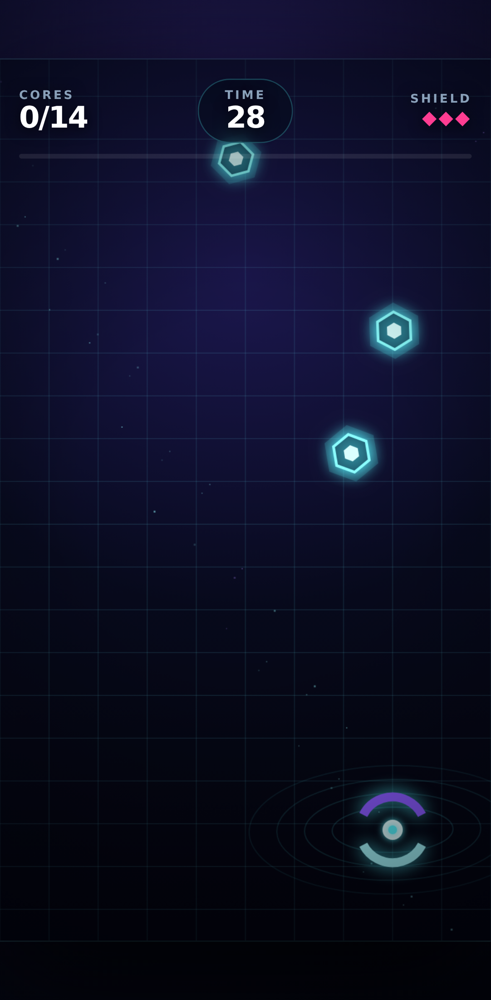

# Neon Salvage — HTML5 Playable Ad Prototype

A mobile-first 30-second playable concept created as an AI-assisted portfolio project for a Junior AI Game Designer application.

## Live build

**Play now:** https://faceitadvanced-code.github.io/neon-salvage-playable/

**Source:** https://github.com/faceitadvanced-code/neon-salvage-playable

**Demo video:** [`artifacts/neon-salvage-demo.mp4`](artifacts/neon-salvage-demo.mp4)



## Gameplay

Guide a magnetic drone horizontally, collect 14 cyan energy cores, and avoid magenta mines before the timer expires.

- one-finger / pointer control;
- deterministic spawn logic;
- score, combo, timer, and three lives;
- immediate win and loss states;
- replay and mock CTA;
- responsive portrait layout;
- no external art, audio, runtime, or CDN dependencies.

## Creative direction

**Mood:** premium neon sci-fi with fast visual readability.

**Visual language:** cyan cores are safe, magenta diamonds are dangerous, and the player is represented by two magnetic arcs. Concentric field lines around the drone make the interaction readable without tutorial art.

**Playable-ad intent:** one mechanic, instant onboarding, short session, strong end card, mobile-safe controls, and quick iteration over scope-heavy perfection.

## Stack

- semantic HTML;
- responsive CSS;
- Canvas 2D;
- vanilla JavaScript ES modules;
- Node built-in test runner;
- Playwright mobile Chromium E2E.

The project was built with AI assistance. The implementation was verified through source review, deterministic unit tests, mobile browser E2E, screenshots, and actual Chromium execution.

## Run

```bash
npm install
npm run serve
# open http://127.0.0.1:4173
```

## Verify

```bash
npm test
npm run test:e2e
```

Verified result:

```text
7 unit tests passed
2 mobile Chromium E2E tests passed
```

E2E covers:

- initial screen and hidden HUD;
- game start;
- pointer movement;
- forced win and CTA visibility;
- replay;
- loss state;
- absence of page errors.

## Structure

```text
index.html             UI, responsive layout, overlays
src/game-core.js       deterministic game state and collision logic
src/game.js            Canvas rendering, input, particles, HUD

test/                  unit tests
e2e/                   Pixel 7 Chromium tests
artifacts/             screenshots and demo recording
```

## Screenshots

- `artifacts/start-screen.png`
- `artifacts/gameplay.png`
- `artifacts/win-screen.png`

## Current limitations

- the CTA is intentionally a mock button;
- no ad-network SDK integration;
- no Unity or Luna Playworks export;
- no sound to keep the prototype dependency-free;
- generated art is procedural rather than production art assets;
- balancing is prototype-level rather than UA-tested.

## Next iteration

1. Instrument start, fail, win, retry, and CTA events.
2. Add an actual store URL and ad-network-safe click handler.
3. Add lightweight WebAudio feedback.
4. Test two difficulty curves and CTA variants.
5. Package against a specific playable SDK size and API constraint.
